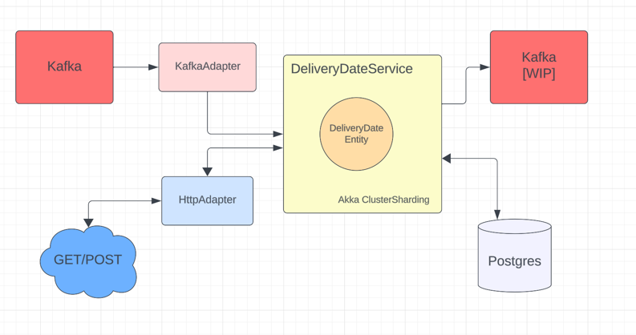

# DeliveryDateService

 This service is intended to be an a simple demonstration of how to use the Akka Durable State library to create
persistent cluster sharded entities without relying on Cassandra as an event journal but rather Postgres as a storage of State

### Domain
 The basic entity of this service is the `DeliveryDateEntity` which is a durable state entity representing the current delivery
date for a package. Whenever new events are generated against the packageId the system updates its DeliveryDate making it more
accurate. 

### How to run
1. `docker-compose up` this will start the Kafka, Zookeeper and Postgres instances
2.  Run the DeliveryDateService system (TODO add this)
3. Open a terminal to Kafka to gain access to the KafkaCLI and run the following command to open the producer shell script
   `kafka-console-producer --topic external-events --bootstrap-server localhost:9092`
4. Paste in the appropriate payload, an example is `{ "packageId": "28370fa8-024d-467f-97d6-fbdbfa25f250", "eventId": 4000 }`
TODO add clarification on this
5. There is a http server running with a helper API in order to access the current DeliveryDate for a package, an example would be
 `GET http://localhost:1234/packageId/18370fa8-024d-467f-97d6-fbdbfa25f250`

### TODOs:  
1) Create an egress kafka projection
2) Finish README to contain more domain information and business logic, explain RuleEngine
3) Learn how to do better markdown formatting

### Diagram

